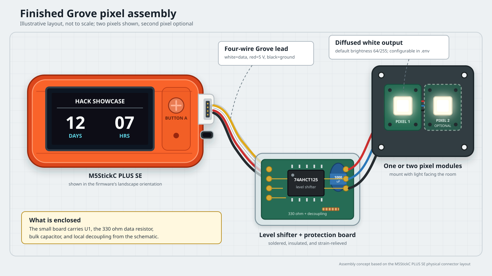
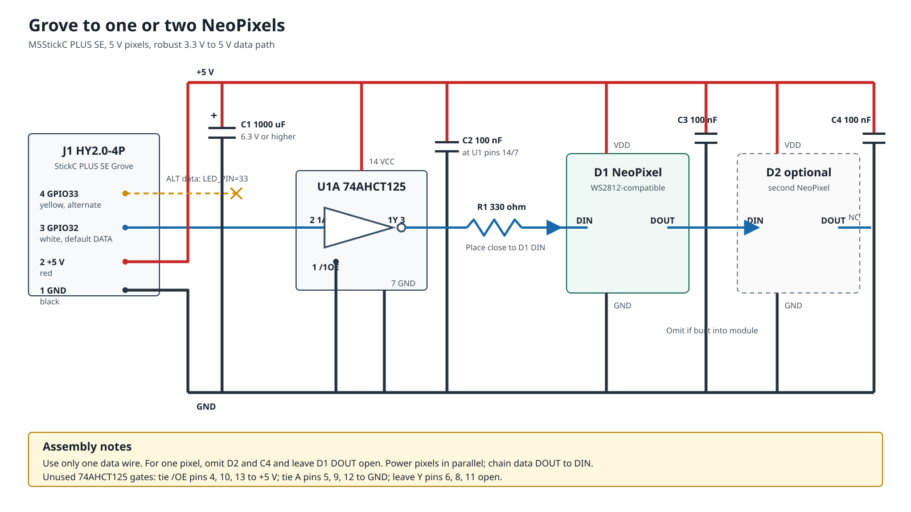

## Finished assembly view



The illustration shows the device in landscape orientation, a short Grove
lead, the level-shifter and protection parts enclosed together, and two pixel
modules on a small mounting plate. For a one-pixel build, omit the dashed
second module.

## Recommended schematic



This circuit uses a `74AHCT125` powered from 5 V so the ESP32's 3.3 V data
signal becomes a reliable 5 V signal for the pixels. The `330 ohm` resistor
belongs near the first pixel, not near the M5Stick.

## Grove connector pinout

M5Stack's J1 pin numbers run in the opposite direction to Seeed's standard
Grove cable pin numbers. Both are shown below. Cable colours refer to a
standard Grove cable; follow the signal labels if a third-party cable uses
different colours.

| M5 J1 pin | Grove pin | Colour | Stick signal | Connection                         |
|-----------|-----------|--------|--------------|------------------------------------|
| 1         | 4         | Black  | GND          | Pixel and level-shifter ground     |
| 2         | 3         | Red    | 5 V          | Pixel and level-shifter supply     |
| 3         | 2         | White  | GPIO32       | Default data (`LED_PIN=32`)        |
| 4         | 1         | Yellow | GPIO33       | Alternate data (`LED_PIN=33`)      |

Connect only one GPIO to the level-shifter input. Do not join GPIO32 and GPIO33.

## Bill of materials

| Reference | Part                     | Notes                                                  |
|-----------|--------------------------|--------------------------------------------------------|
| U1        | 74AHCT125                | Use AHCT, not HC, for a reliable 3.3 V input threshold |
| R1        | 330 ohm resistor         | Any value from 300 to 500 ohm is suitable              |
| C1        | 1000 uF electrolytic     | Rated 6.3 V or higher; observe polarity                |
| C2        | 100 nF ceramic           | Place next to U1 pins 14 and 7                         |
| C3, C4    | 100 nF ceramic per pixel | Omit when already fitted to a pixel module             |
| D1, D2    | NeoPixel/WS2812 RGB      | 5 V; D2 is optional                                    |
| J1        | Grove cable/breakout     | Provides GPIO32, GPIO33, 5 V, and ground               |

## Assembly

1. Wire J1 pin 3 to U1 pin 2 for the default GPIO32 configuration. To use
   GPIO33, move this wire to J1 pin 4 and set `LED_PIN=33` in `.env`.
2. Tie U1 pin 1 (`/1OE`) low. Connect U1 pin 3 through R1 to D1 `DIN`.
3. Connect the 5 V and ground rails to every pixel in parallel.
4. For two pixels, connect D1 `DOUT` to D2 `DIN`. Leave the last `DOUT` open.
5. Put C1 across 5 V and ground where power reaches the pixels. Put one 100 nF
   capacitor close to each bare pixel and another close to U1.
6. Tie unused U1 output-enable pins 4, 10, and 13 high. Tie unused input pins
   5, 9, and 12 low. Leave unused outputs 6, 8, and 11 open.

For one pixel, omit D2 and C4. The same firmware supports either count through
`LED_COUNT`.

## Firmware configuration

The schematic's default wiring corresponds to:

```dotenv
LED_TYPE="NEOPIXEL"
LED_COUNT=1
LED_PIN=32
LED_BRIGHTNESS=64
```

Change `LED_COUNT` to `2` after fitting D2. Change `LED_PIN` only when the data
wire is physically moved to the other Grove signal pin.

## Direct-drive prototype

For a short workbench connection, many WS2812-compatible pixels accept the
ESP32's 3.3 V signal while powered from 5 V. In that case U1 and C2 can be
omitted and the selected GPIO can feed R1 directly. This is less tolerant of
part variation, cable length, temperature, and supply variation, so the
level-shifted circuit is the deployment design.

Always share ground. Make or break connections with power removed. If that is
not possible, connect ground first, then 5 V, then data; disconnect in reverse.

## References

* [M5StickC PLUS SE product schematic and HY2.0-4P pin map](https://docs.m5stack.com/en/products/sku/K016-P-SE)
* [Seeed Studio Grove connector and cable standard](https://wiki.seeedstudio.com/Grove_System/)
* [Adafruit NeoPixel best practices](https://learn.adafruit.com/adafruit-neopixel-uberguide/best-practices)
* [Adafruit NeoPixel logic-level guidance](https://learn.adafruit.com/adafruit-neopixel-uberguide/logic-level)
